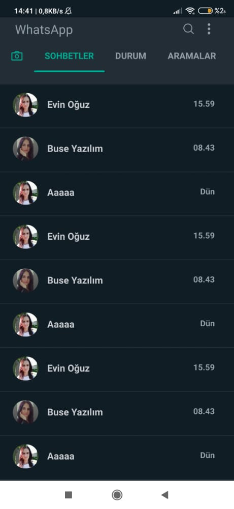
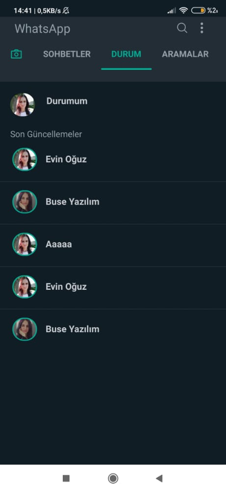
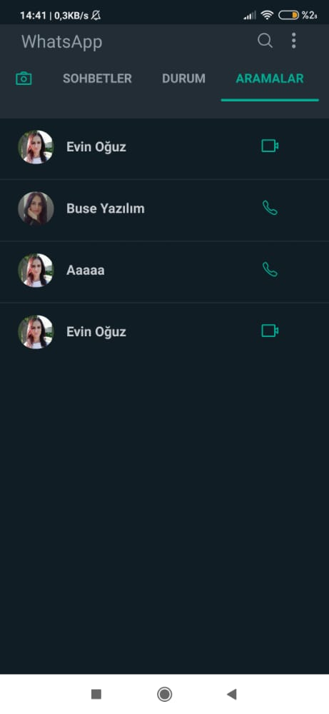

# Kodluyoruz Istanbul React Native Bootcamp Homework-Week1
 
 ### 'WhatsApp Messenger' mobil uygulamasının tasarlandı.
<div>





</div>

## Projenin Çalıştırılması
Proje indirildikten veya forkladıktan sonra, 'Visual Studio Code' editörü ile proje açılır. Eğer terminalde proje klasörü açık değilse 
```
cd "C:\Users\Oguz\Desktop\Kodluyoruz_ReactNative_Projects\EvinOguz\week2"
``` 
şeklinde proje dizini açılır.

  Terminalde;
```
npm install

```
komut satırı ile projede kullanılan paketler "node_modules" klasöründe oluşturulur.
```
npx react-native start
```
komutu çalıştırılır.
```
npx react-native run-android
```
komutu çalıştırılır.
